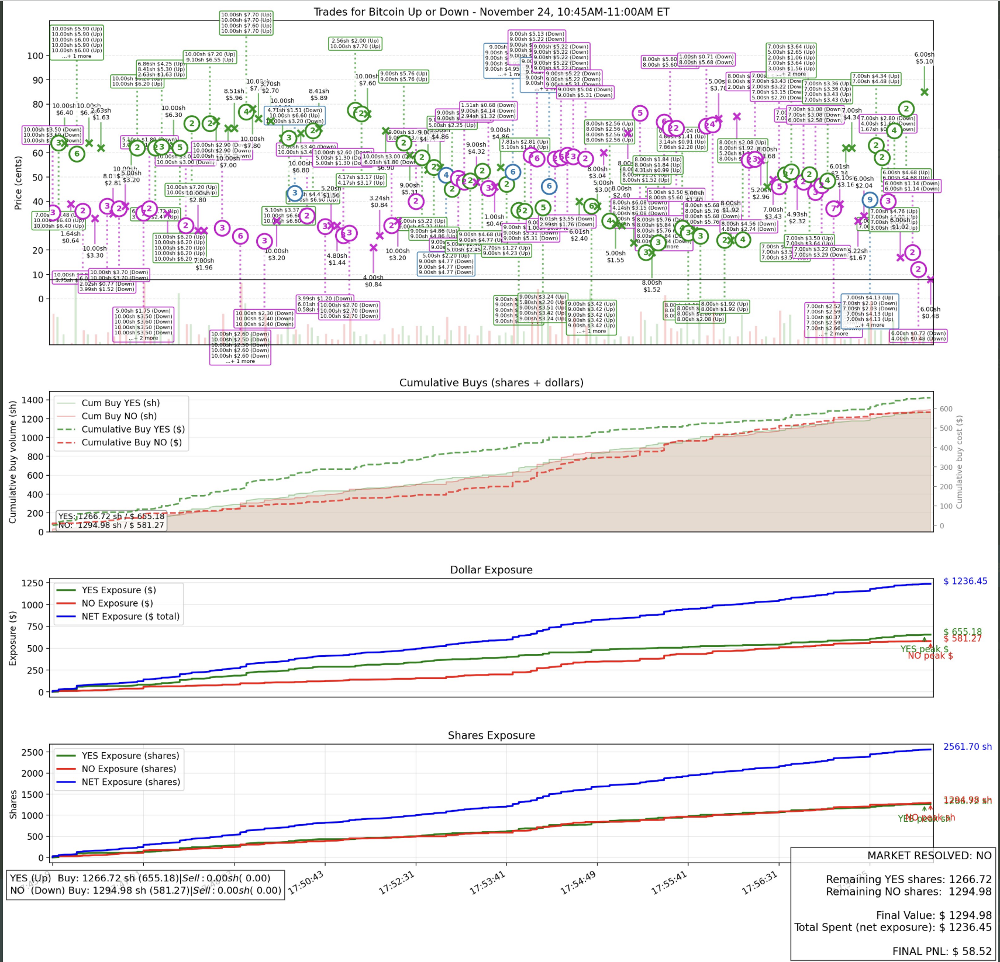

# Volatility Scalping

A Python-based automated trading bot for Polymarket's binary prediction markets, implementing a **risk-free box spread** strategy on short-duration (15-minute) BTC price markets.

## Inspiration

This project was inspired by [this thread on X by @thejayden](https://x.com/thejayden/status/1996281508550877314). Where we try to replicate this strat:




---

## The Strategy

### Risk-Free Box Spread

This strategy exploits the mathematical invariant that in binary prediction markets, **YES + NO = $1.00** at settlement. By acquiring both sides at a combined cost less than $1.00, you lock in guaranteed profit regardless of the outcome.

The strategy is sketched in the included PDF: [`leg_strat_pm.pdf`](leg_strat_pm.pdf)

### Core Concept

The **Profit Invariant**:

```
C_target = 1.00 - ξ

μ_yes + μ_no ≤ C_target
```

Where:
- `ξ` is the minimum profit margin (e.g., 0.02 = 2 cents per dollar)
- `μ_yes` and `μ_no` are the volume-weighted average prices (VWAPs) for each side

**Example:**
```
Buy YES at $0.48 (VWAP)
Buy NO  at $0.50 (VWAP)
Combined: $0.98 ≤ C_target
Payout at settlement: $1.00
Locked profit: $0.02 (2%)
```

### Two Operating Modes

**Mode A: Open (Trap Entry)** — When `ΔQ ≈ 0` (balanced inventory)
- Places limit buy orders ("traps") on both YES and NO sides
- Trap prices calculated as: `π_limit = C_target - P_opposing_ask`
- Waits for market volatility to fill one side

**Mode B: Hedge (Closing the Leg)** — When `|ΔQ| > 0` (exposed)
- One side has filled, creating inventory imbalance
- Buys the opposite side to neutralize exposure
- Maximum hedge price: `π_hedge = C_target - μ_own`

### Execution Flow

1. **Market Discovery**: Automatically finds the next BTC 15-minute Up/Down market
2. **Trap Placement**: Places symmetric limit orders on both outcomes
3. **Fill Detection**: Monitors for order fills via WebSocket
4. **Hedge Execution**: When one side fills, immediately hedges the opposite
5. **Profit Lock**: Both sides acquired → profit locked until settlement
6. **Repeat**: Moves to the next 15-minute market

---

## Architecture

```
┌─────────────────────────────────────────────────────────────┐
│                        main.py                              │
│                   (Entry point & orchestration)             │
└─────────────────────────────────────────────────────────────┘
                              │
        ┌─────────────────────┼─────────────────────┐
        ▼                     ▼                     ▼
┌───────────────┐    ┌────────────────┐    ┌────────────────┐
│ market_       │    │ strategy_      │    │ polymarket_    │
│ discovery.py  │    │ engine.py      │    │ client.py      │
│               │    │                │    │                │
│ Finds BTC     │    │ Core trading   │    │ CLOB API       │
│ 15-min mkts   │    │ logic & state  │    │ wrapper        │
└───────────────┘    └────────────────┘    └────────────────┘
                              │
        ┌─────────────────────┼─────────────────────┐
        ▼                     ▼                     ▼
┌───────────────┐    ┌────────────────┐    ┌────────────────┐
│ orderbook_    │    │ user_          │    │ models.py      │
│ manager.py    │    │ channel.py     │    │                │
│               │    │                │    │ Data models    │
│ WebSocket     │    │ Authenticated  │    │ for inventory, │
│ orderbook     │    │ fill detection │    │ orders, etc.   │
└───────────────┘    └────────────────┘    └────────────────┘
```

### Key Components

| File | Description |
|------|-------------|
| `main.py` | Entry point; orchestrates market discovery and trading loop |
| `strategy_engine.py` | Core strategy logic: trap placement, hedging, profit locking |
| `polymarket_client.py` | Wrapper around Polymarket's CLOB API for order management |
| `orderbook_manager.py` | Real-time orderbook updates via WebSocket |
| `user_channel.py` | Authenticated WebSocket for fill detection |
| `market_discovery.py` | Auto-discovers BTC 15-minute markets via Gamma API |
| `config.py` | Configuration loading from environment variables |
| `models.py` | Data models (inventory state, orders, orderbooks) |
| `safety.py` | Risk management utilities |
| `logger.py` | Colored console logging |
| `leg_strat_pm.pdf` | Detailed strategy specification |

---

## Setup

### Prerequisites

- Python 3.10+
- A Polymarket account with funds
- Your wallet's private key (EOA or Polymarket proxy wallet)

### Installation

1. **Clone the repository**
   ```bash
   git clone https://github.com/blockchainhansi/vola_scalping_polymarket.git
   cd vola_scalping_polymarket
   ```

2. **Create a virtual environment**
   ```bash
   python -m venv .venv
   source .venv/bin/activate  # On Windows: .venv\Scripts\activate
   ```

3. **Install dependencies**
   ```bash
   pip install -r src/requirements.txt
   ```

4. **Configure environment**
   ```bash
   cp src/.env.example src/.env
   ```
   
   Edit `src/.env` and fill in your values:
   ```env
   PRIVATE_KEY=your_private_key_here
   RPC_URL=https://polygon-mainnet.g.alchemy.com/v2/your_key_here
   ```

### Configuration

Key parameters in `.env`:

| Variable | Description | Default |
|----------|-------------|---------|
| `PRIVATE_KEY` | Your wallet private key (without 0x prefix) | Required |
| `PROFIT_MARGIN` | Target profit margin ξ (e.g., 0.02 = 2%) | `0.02` |
| `MAX_EXPOSURE` | Maximum ΔQ before forced hedging | `100` |
| `TRAP_ORDER_SIZE` | Size of each trap order in tokens | `10` |
| `RANGE_MIN` / `RANGE_MAX` | Only trade when prices are in this range | `0.40` / `0.60` |

---

## Running

```bash
cd src
python main.py
```

The bot will:
1. Connect to Polymarket's CLOB API
2. Discover the next BTC 15-minute market
3. Subscribe to orderbook updates via WebSocket
4. Begin placing trap orders and managing positions
5. Automatically transition to the next market after each expiry

### Stopping

Press `Ctrl+C` to gracefully stop. The bot will:
- Cancel all open orders
- Attempt to flatten any open positions
- Shut down cleanly

---

## Safety Features

- **Exposure Limits**: Stops placing new traps if |ΔQ| exceeds `MAX_EXPOSURE`
- **Expiry Buffer**: Stops new traps 60 seconds before market expiry
- **Final Exit**: Cancels all orders 10 seconds before expiry
- **Auto-Flatten**: Attempts to sell unhedged inventory on shutdown
- **Reconnection**: Automatic WebSocket reconnection on disconnect

---

## Disclaimer


1. **Regulatory Restrictions**: Polymarket and similar prediction markets are **prohibited in certain countries**. It is your sole responsibility to verify whether using such platforms is legal in your jurisdiction.

2. **No Liability**: The author of this repository assume **no responsibility or liability** for any losses, damages, legal issues, or other consequences arising from the use of this code. Use at your own risk.

3. **Not Financial Advice**: This repository is provided for **educational and entertainment purposes only**. Nothing in this code or documentation constitutes financial, investment, trading, or legal advice.

4. **No Guarantees**: There is no guarantee of profitability. Automated trading involves significant risk, including the potential loss of your entire investment.

5. **Use at Your Own Risk**: By using this code, you acknowledge that you understand the risks involved and agree to take full responsibility for your actions.

## Contact

This is a highly nerfed version. If you are a quant or developer who wants to collaborate on the competitive version, shoot me a message on my TG: Mankiw2
